# Predicting Wine Quality
Final Project for STA 6543 - Data Analytics Algorithms II

The University of Texas at San Antonio

## Contributors

- Matthew Smith
- Stuti Singh
- DeRail Spikes
- Priscilla Muniz

## Introduction

Wine has been produced for thousands of years serving many different cultures and purposes throughout time. The earliest evidence of wine being cultivated was around 4500 BC in the Middle East. The ancient Greeks and Romans devoted gods to the drink, Dionysus and Bacchus respectively, and often held feasts and celebrations where driking was an integral part. Consumption of wine was prevelant in the Jewish faith and was adopted by Christians as a commemoration of Jesus' Last Supper.

The alcoholic beverage is typically made from fermented grapes and occasionally some extra plants. Vinification, the production of wine, is the conversion of fermeting specific fruit into alcohol and distributing in to consumers in bottles. Different varieties of grapes and strains of yeasts are made for consumers' preference. These variations result from the biochemical properties, the reactions during fermentation, the growing enviornment of the grape, and the prduction process.

There are many physiochemical properties of wine that are important in determining taste, feel, and aging. Acidity is an important attribute that takes three forms: titratable, volatile, and total. Titrable acidity is the measurement of the total titrable acids and free hydrogen ions present. Titration is the method where the acid is neutralized by a base and can be measured. Common titrable acids include tartaric, malic, citric, and carbonic. Volatile acids cannot be measured through titration and therefore are measured by a steam distallation process. Acetic acid and lactic acid are two of the most important and prominent volatile acids in wine. Total acidity is the combination of the titrable acidity and volatile acidity.

In 2018, total wine consumption in the US was estimated to be around 966 million gallons. Based on the upward trend in wine consumption from 2005 - 2018 we are expected to see an increase in wine consumption in the following years

## Data Introduction and Variable Definitions

The dataset used in this project is provided by Paulo Cortez, an associate professor at the University of Minho in Portugal. Originally , two datasets sere avaliable related to red and white variants of the Portugese "Vino Verde" wine unique to the nothwest region of the country. Physiochemical properties about each wine were recorded and used to determine the quality of the wine as a sensory output (human preference). While his original research focused on data mining and comparing quality results for both red and whites, this project is focused on prdicting quality in red and white wines.

The data was collected from May 2004 to February 2007 and consisted of wine certified by the Comissao de Viticultura de Regiao dos Vinhos Verdes (CVRVV), an organizationa designed for the quality testing and marketing of the product. There are 12 recorded variables and 1599 enteries (samples) for red wine and 4898 samples for white. Each sample was evaluated by at least three "sensory assessors" using blind taste tests who graded the wine on a 0 (very bad) to 10 (excellent) scale. The final sensory score (quality) was calculated as the median of the assessors' evaluations and is the response variable. The remaining eleven variables are the predictors for which the quality should be reflected by. The list of variables and descriptions are outlined in the following table:

| Variable | Description |
| :---  | :--- |
| Fixed Acidity | Most acids involved with wine or fixed or nonvolatile (do not evaporate quickly) |
| Volatile Acidity | The amount of acetic acid in wine, which at too high of levels can lead to an unpleasant, vinegar taste |
| Citric Acid | Found in small quantities, citric acid can add 'freshness' and flavor to wines |
| Residual Sugar | The amount of sugar remaining after fermentation stops, it's rare to find wines with less than 1 gram/liter and wines with greater than 45 grams/liter are considered sweet |
| Chlorides | The amount of salt in the wine|
| Free Sulfur Dioxide | The free form SO2 exists in equilibrium between molecular SO2 (as a dissolved gas) and bisulfite ion; it prevents microbial growth and the oxidation of wine |
| Totat Sulfur Dioxide | Amount of free and bound forms of SO2; in low concentrations, SO2 is mostly undetectable in wine, but at free SO2 concentrations over 50 ppm, SO2 becomes evident in the nose and taste of wine |
| Density | The density if wineis close to that of water depending on the percent alcohol and sugar content |
| pH | Describes how acidic or basic a wine is on a scale from 0 (very acidic) to 14 (very basic); most wines are between 3 - 4 on the pH scale |
| Sulphates | A wine additive which can contribute to sulfur dioxide gas (SO2) levels, which acts as an antimicrobial and antioxidant |
| Alcohol | The percent alcohol content of the wine |
| Quality | Output variable (based on sensory data, score between 0 and 10)

## Preprocessing Predictors

### Dealing with Missing Variables

When running an analysis to determine the proportion of missing values for the red and white wine datasets, it was quickly determined there were none.

### Zero Variance

When running an analysis on zero or near-zero variance predictors, it is shown that there are none.

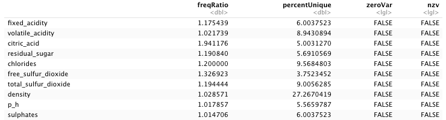 

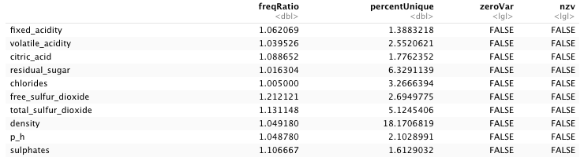

### Correlation Between Predictors

The following are correlation matrices for the red wine. This was done to plot the 11 predictors to indicate positive and negative relationships. There is a very heavy positive correlation between citric acid and fixed acidity (0.67), represented in blue. There are also negative correlations between citric acid and volatile acidity (-0.55), citric acid and pH (-0.54), and density and alcohol (-0.5), represented in red. The strong negatice linear correlation between pH and fixed acidity (-0.68) might cause multicollnearity. However, none of these correlations are greater than 0.75.

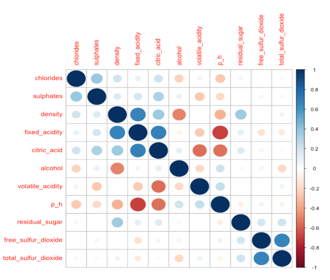

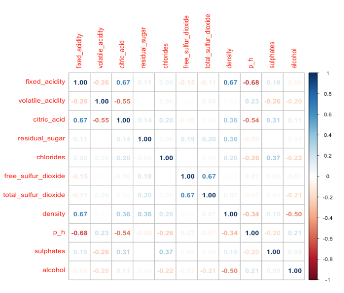

In the white wine dataset, there is a strong positive correlation between totatl sulfur dioxide and free sulfur dioxide (0.62), and density and total sulfur dioxide (0.53). The positive relationship between density and residual sugar (0.84) may indicate significant varaibles in linear regression models. A concern for multicollinearity arises when looking at the negative relationship between denisty and alcohol (-0.78). Two of the linear relationships are above 0.75, which may influence the results of the regression models.

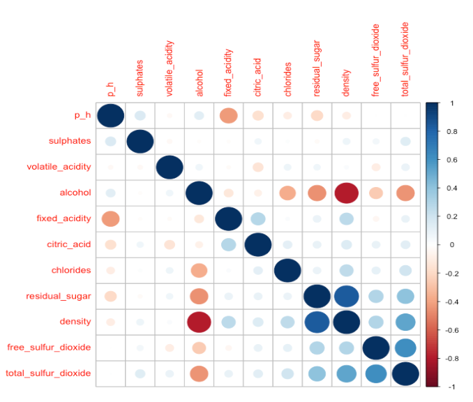

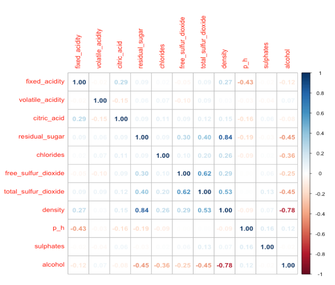

### Transformations

#### Histograms

The first figure is for the 11 predictors in the red wine dataset. Fixed acidity, density, and pH are relatively normal, indicating that they might be useful in the linear regression models. Volatile acidity, residual sugar, chlorides, free sulfur dioxide, total sugar dioxide, sulphates, and alcohol all tend to be rightskewedand appear to take the form of smaller values than larger values. Citric acid looks to be a bit right skewed, but it can be argued that it can be uniform for the middle values.

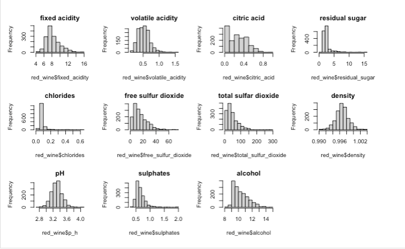

When looking at the same 11 predictors for white wine, fixed acidity, volatile acidity, total sulfur dioxide, pH, and sulfates looke relatively normal. Citric acid, residual sugar, chlorides, free sulfur dioxide, and density are all heavily right skewed. Alcohol appears to be somewhat uniform with the exception of the spike at 9.

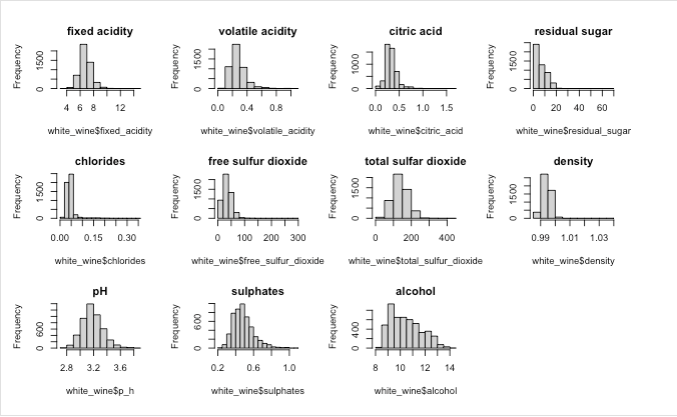

#### Boxplots

The first figure shows the boxplots for red wine. Fixed acidity, volatile acidity, residual sugar, chlorides, free sulfur dioxide, total sulfur dioxide, and sulphates are heavily right skewed and have many outliers on the upper end of the range. Citric acid and alcohol have very few outliers on the right end, Density and pH are centered towards the middle and have outliers on both ends. Alcohol has the least number of outliers.

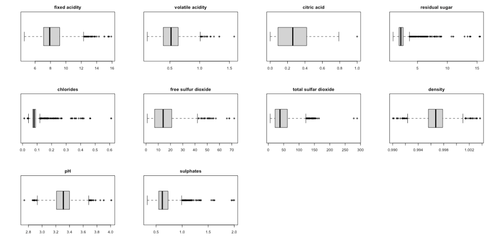

When looking at white wine, volatile acid, chlorides, free sulfur dioxide, and sulphates have many outliers in the upper range. Fixed acidity, citric acid, chlorides, total sulfur dioxide, and pH have outliers on both the upper and lower limits. Residual sugar and density have barely any outliers on the upper end. Alcohol has no outlier.

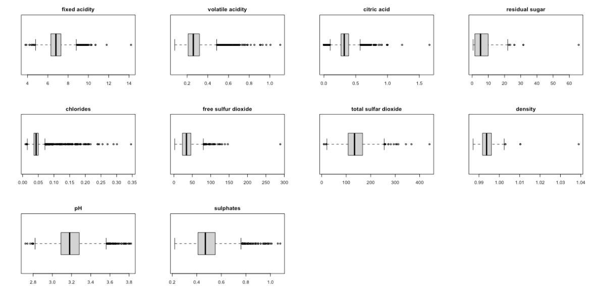

#### Skewness

Skewness is a measure of symmetry. A positive skew implies that the mean of the data is greater than the median and the distribution is right skewed. Due to the number of variables in both datasets that were skewed, the team decided not to perform any sort of transformations so that the data would not be influenced, and results would remain true to the original datasets.

Skewness for Red Wine

| Variable | Skewness | Category |
| :--- | :--- | :--- |
| Fixed Acidity | 0.980984 | Moderately |
| Volatile Acidity | 0.6703331 | Moderately |
| Citric Acid | 0.3177403 | Moderately |
| Residual Sugar | 4.53214 | Heavily |
| Chlorides | 5.66964 | Heavily |
| Free Sulfur Dioxide | 1.248222 | Heavily |
| Total Sulfur Dioxide | 1.512689 | Heavily |
| Density | 0.07115397 | Approximately Symmetrical |
| pH | 0.1933203 | Approximately Symmetrical |
| Sulphates | 2.424118 | Heavily |
| Alcohol | 0.8592144 | Moderatley |

Skewness for White Wine

| Variable | Skewness | Category |
| :--- | :--- | :--- |
| Fixed Acidity | 0.6473548 | Moderately |
| Volatile Acidity | 1.576014 | Heavily |
| Citric Acid | 1.281135 | Heavily |
| Residual Sugar | 1.076343 | Heavily |
| Chlorides | 5.020254 | Heavily |
| Free Sulfur Dioxide | 1.405883 | Heavily |
| Total Sulfur Dioxide | 0.3904706 | Moderately |
| Density | 0.9771742 | Moderately |
| pH | 0.4575022 | Moderately |
| Sulphates | 0.9765952 | Moderately |
| Alcohol | 0.4870435 | Moderatley |

### Data Splitting

This report is focused on predicting the quality of wine based on certain predictors. A common way to perform such analyses is to split the data into a testing set and training set. The training set is used to build different models and the testing set is used to judge the performace of those models. The method used in this analysis is the stratified random split of the quality variable with 80% of the data used for training and the remaing 20% used for testing.

The following tables are relative frequencies for the quality variable for each wine type before and after the split. The first shows the red wine, which varies from three to eight in quality, and the second shows white wine which ranges from three to nine in quality. The frequency for the training set for each table is very similar to the original dataset, showing that the training set is a valid depiction of the original data.

Relative Frequency for Quality of Red Wine Before and After Split

| Quality | 3 | 4 | 5 | 6 | 7 | 8 |
| :--- | :--- | :--- | :--- | :--- | :--- | :--- |
| Original | 0.00625 | 0.03314 | 0.42589 | 0.39899 | 0.12445 | 0.01125 |
| Training | 0.00702 | 0.03123 | 0.42701 | 0.39891 | 0.12568 | 0.01015 |

Relative Frequency for Quality of White Wine Before and After Split 

| Quality | 3 | 4 | 5 | 6 | 7 | 8 | 9 |
| :--- | :--- | :--- | :--- | :--- | :--- | :--- | :--- |
| Original | 0.00408 | 0.03328 | 0.29747 | 0.44875 | 0.17966 | 0.03572 | 0.00102 |
| Training | 0.00332 | 0.03266 | 0.29880 | 0.44884 | 0.18219 | 0.03317 | 0.00102 |

When looking at the bar plots of the red wine data, the distribution is very similar in both the original set and the training set. The same can be said for the white wine split. This implies that the training set is a valid depiction of the original data and is appropriate for the analyses.

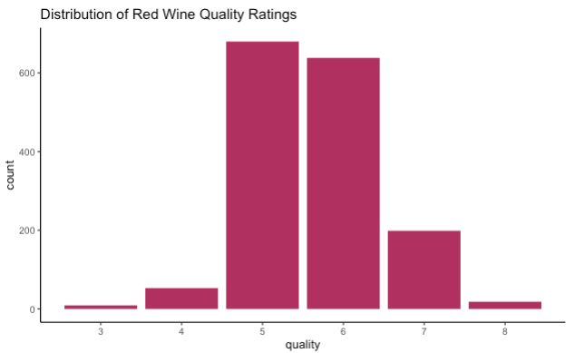 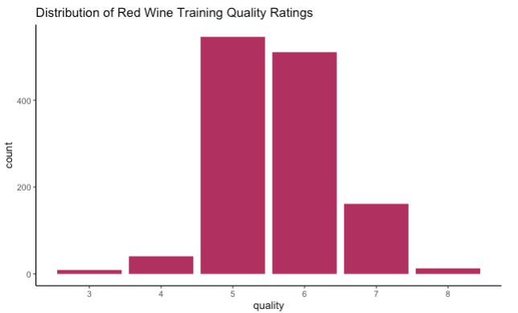

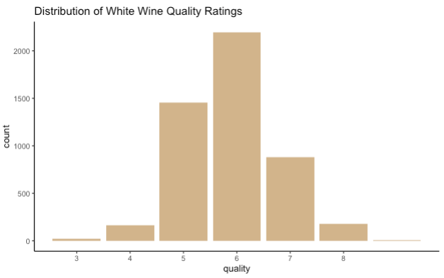 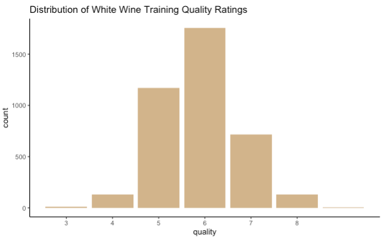

### Model Building

This project focused on predicting the quality of wine based on the 11 physiochemical attributes. Different linear and non linear models were used to determine the best fit for the data.

When conducting statistical analyses, the R^2 value is the proportion of variance from the response variable, Quality, that is explained by the model. The Root Mean Squared Error (RSME) is a measure of the error of the model in predicting the data. It is the standard deviation of the residuals and measures how far from the regression line the data is. The Mean Absolute Error (MAE) measures the average magnitude of the errors without considering direction and measures accuracy. The R^2 value is inversely related to the RMSE and MAE.

Red Wine Model Summary

*Linear Models*

| Model | Tuning Parameters | R | RMSE |
| :--- | :--- | :--- | :--- |
| OLS | N/A | 0.3665036 | 0.6492043 |
| PCR | ncomp = 10 | 0.3659567 | 0.6494756 |
| PLS | ncomp = 9 | 0.3658563 | 0.6495401 |
| Ridge | lambda = 0.05714 | 0.3676247 | 0.6486788 |
| Lasso | fraction = 0.857 | 0.3680043 | 0.6485356 |
| ENET | fraction = 0.85, lambda = 0.1 | 0.3684173 | 0.64825 |

*Non-Linear Models*

| Model | Tuning Parameters | R | RMSE |
| :--- | :--- | :--- | :--- |
| KNN | k = 19 | 0.3865651 | 0.6418848|
| MARS | nprune = 13, degree = 1 | 0.4000955 | 0.6321583 |

*Tree Models*

| Model | Tuning Parameters | R | RMSE |
| :--- | :--- | :--- | :--- |
| Cart | cp = 0.00764 | 0.3801212 | 0.6430739 |
| RF | mtry = 11 | 0.5694363 | 0.5401204 |
| CIF | mincriterion = 0.75 | 0.3678555 | 0.6488026 |
| Boosted | shrinkage = 0.01 | 0.4875669 | 0.587191 |
| Cubist | committees = 50, neighbors = 0 | 0.4032834 | 0.6319219 |
| Bagged | N/A | 0.4523526 | 0.6113595 |

White Wine Model Summary

*Linear Models*

| Model | Tuning Parameters | R | RMSE |
| :--- | :--- | :--- | :--- |
| OLS | N/A | 0.2241284 | 0.8140203 |
| PCR | ncomp = 9 | 0.248470 | 0.8008461 |
| PLS | ncomp = 9 | 0.2435716 | 0.8009971 |
| Ridge | lambda = 0 | 0.2241284 | 0.8140203 |
| Lasso | fraction = 1 | 0.2282285 | 0.8110144 |
| ENET | fraction = 0.95, lambda = 0 | 0.2241284 | 0.8140203 |

*Non-Linear Models*

| Model | Tuning Parameters | R | RMSE |
| :--- | :--- | :--- | :--- |
| KNN | k = 9 | 0.3423041 | 0.7475887 |
| MARS | nprune = 20, degree = 1 | 0.220699 | 0.8345465 |

*Tree Models*

| Model | Tuning Parameters | R | RMSE |
| :--- | :--- | :--- | :--- |
| Cart | cp = 0.0026 | 0.2727819 | 0.7873644 |
| RF | mtry = 10 | 0.4743465 | 0.6683869 |
| CIF | mincriterion = 0.95 | 0.2671125 | 0.7900257 |
| Boosted | shrinkage = 0.1 | 0.4164556 | 0.7086652 |
| Cubist | committees = 100, neighbors = 5 | 0.4105473 | 0.7125549 |
| Bagged | N/A | 0.279011 | 0.783021 |

### Conclusions

The data was very well processed but most of the predictors were heavily or moderately right skewed. The decision to not perform any transformation on the original dataset was due to the low number of variables that would not require transformations. This would have been an influence on the original dataset and the team members thought it would have not been an accurate depiction of the original dataset. Going through with the analysis, the R2 values were not promising. The Random Forest model performed best in both the red and white wine datasets, leading to the assumption that the data was not linear.

After careful consideration and multiple attempts, it was determined that the regression models would not be able to accurately predict “quality” due to human error. The response variable was a median of multiple human ratings and could very well remain unpredictable due to different preferences of different people.

A topic of future analyses could be machine learning classification of red or white wine based on the physiochemical properties. The results of a test including quality could be compared to the results of a test not including quality to further investigate the reason for low prediction accuracy in this report.
